# Nombre del proyecto

Aplicacion de ping pong

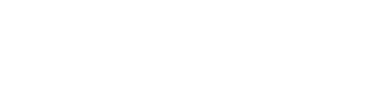


# Colaboradores


|     Nombres completos     |   Carnets   |
| ------------------------- | ----------- |
| Roberto Arturo Duarte Mejía | DM240115 |
| Eduardo Alfredo Ramirez Torres | RT240549 |
| Salvador Enrique Delgado Peñate | DP240093 |
| Oscar Daniel Soto Jovel | SJ241841 |
| Cristian Alexander Hernández Valiente | HV240081 |
| Oscar Vladimir Alarcón Mendoza | AM221856 |


# Grupo Teorico 

Desarrollo de Aplic. Web con Soft. Interpret. en el Servidor DSS404 G03T

# Proyecto de Catedra DSS404

[Enlace a tablero de Trello](https://trello.com/invite/b/67ce6f4e33493a6e66375935/ATTI42db62758f5176ec412da50022746d6bA87E8188/tablero-proyecto-de-catedra-dss)

[Enlace a figma](https://www.figma.com/design/yzLNNozxwdzOOodtyO7p4n/ProyectoCatedraDSSMockUps?node-id=0-1&t=9uwFhqwI2v0alzXE-1)

# Capturas de pantalla

## Login y Sign Up

| Login | Sign Up |
|-------|---------|
| 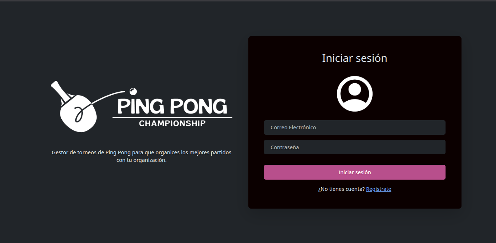 | 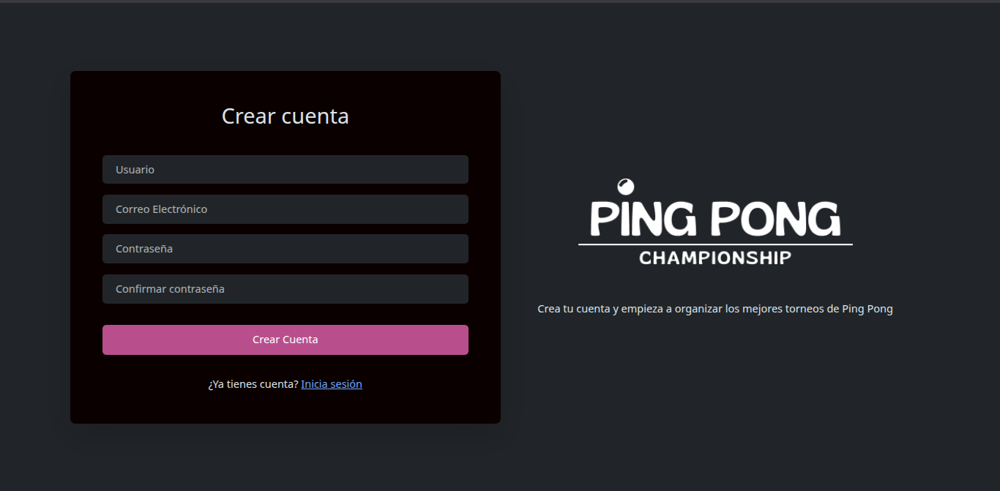 |

## Pagina Principal
  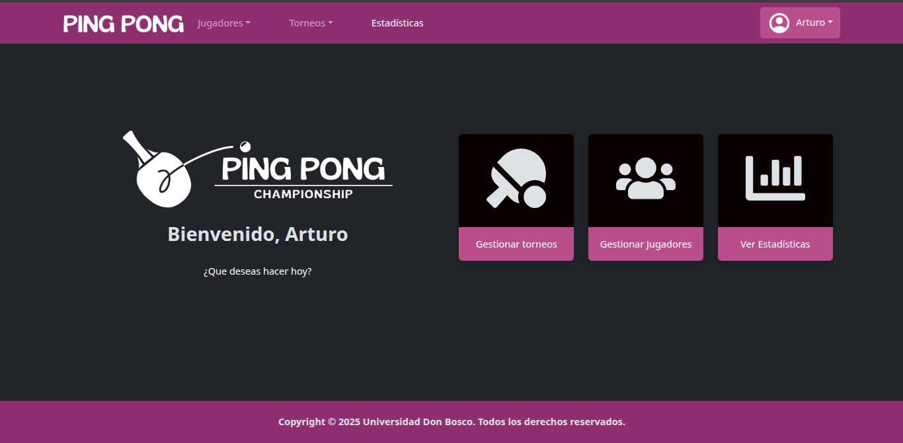
  
## Ver perfil de administrador
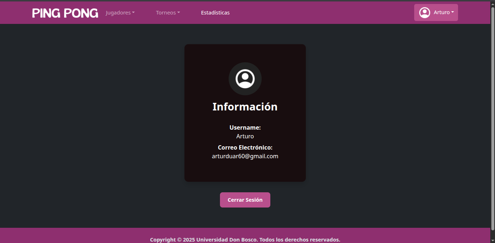


## Ver torneos y ver jugadores

| Torneos | Jugadores |
|---------|-----------|
| 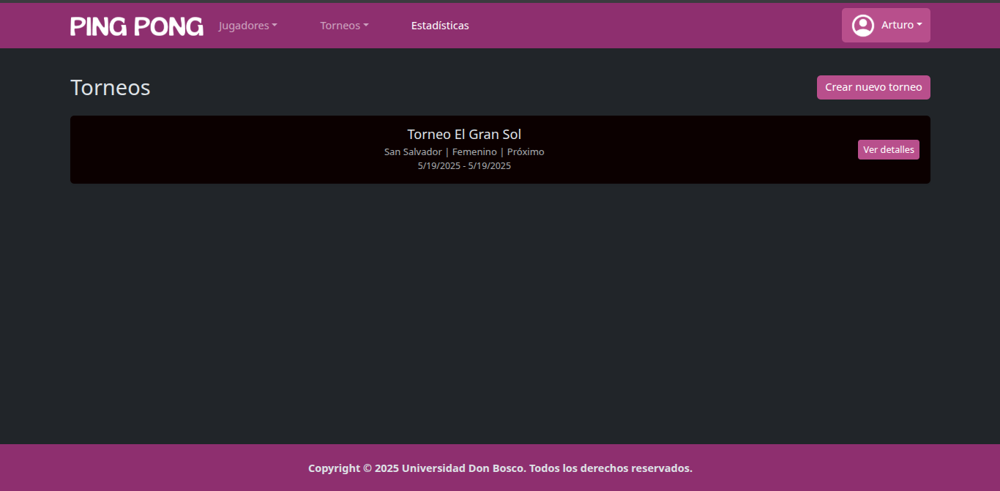 | 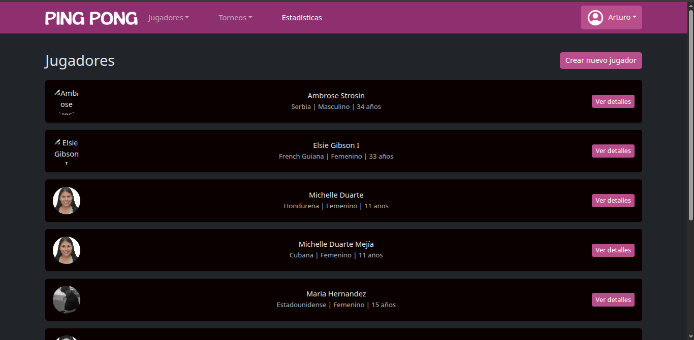 |

## Crear Torneos y Jugadores

| Torneos | Jugadores |
|---------|-----------|
| 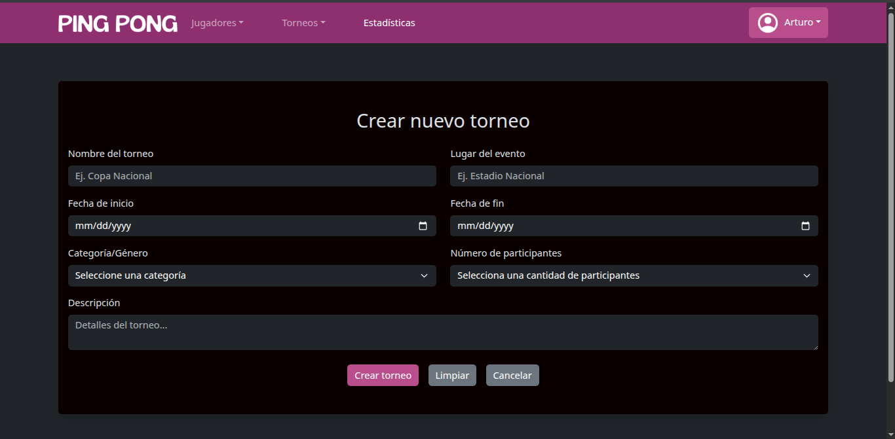 | 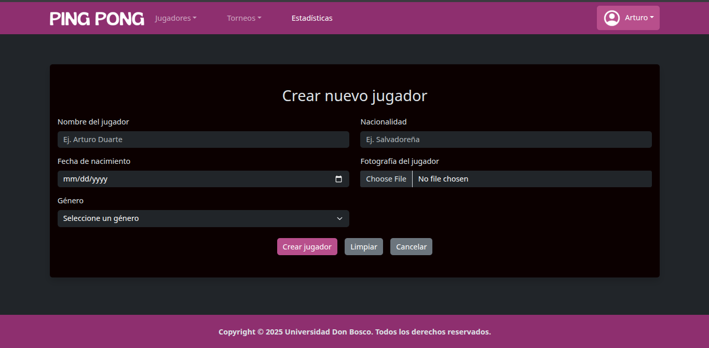 |

## Torneo individual y Jugador Individual

| Torneos | Jugadores |
|---------|-----------|
| 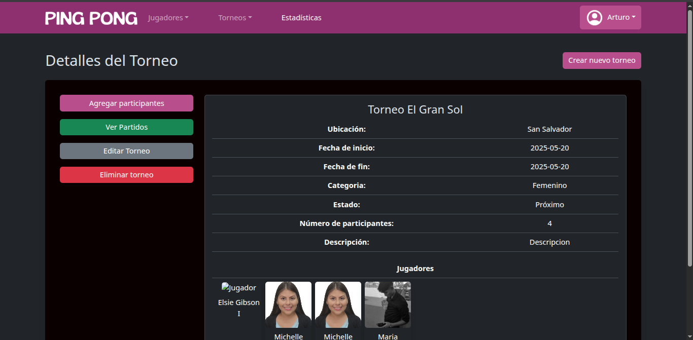 | 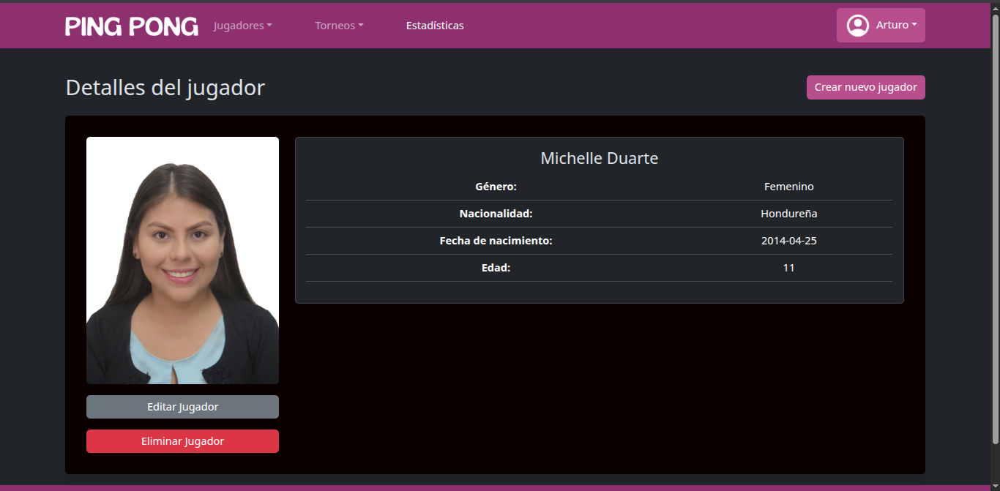 |

## Añadir jugadores al torneo

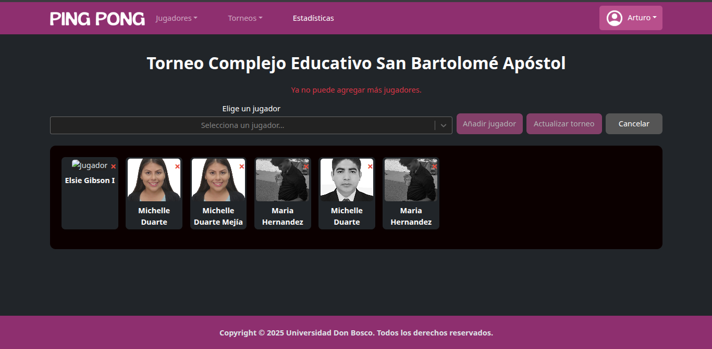

## Ver Estadisticas

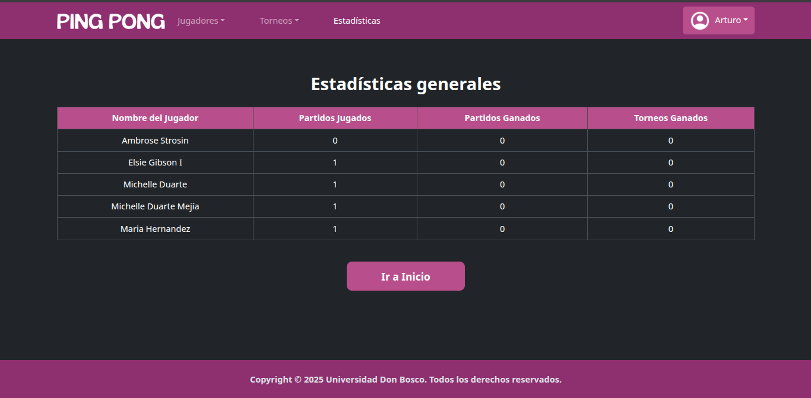

---

# 🏓 Ping Pong App

Aplicación web construida con **Laravel** para el backend y **React + Vite** para el frontend.

---
1. **Clona el repositorio**

   ```bash
   git clone https://github.com/ArturDuar/ping-pong-app.git
   cd ping-pong-app
   ```
   
   ## ⚙️ Instalación del Backend (Laravel)

2. **Instala las dependencias de PHP**

   ```bash
   composer install
   ```

3. **Copia el archivo de entorno**

   ```bash
   cp .env.example .env
   ```

4. **Genera la clave de la aplicación**

   ```bash
   php artisan key:generate
   ```

5. **Ejecuta las migraciones**

   ```bash
   php artisan migrate
   ```

6. **Puebla la base de datos con datos de prueba**

   ```bash
   php artisan db:seed
   ```

7. **Levanta el servidor de desarrollo**

   ```bash
   php artisan serve
   ```

---

##  Instalación del Frontend (React + Vite)

1. **Navega al directorio del frontend**

   ```bash
   cd proyecto-catedra-frontend2
   ```

2. **Instala las dependencias de Node**

   ```bash
   npm install
   ```

3. **Levanta el servidor de desarrollo**

   ```bash
   npm run dev
   ```

---
